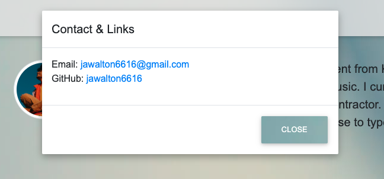

# Jacob-Walton-Portfolio

I've created a portfolio page for myslef which displays a short bio and a few github repo links.
I've also included a start page and a small contact modal.

This page was created using HTML, CSS, Javascript, JQuery, Bootstrap and MDBootstrap.

https://jawalton6616.github.io/
